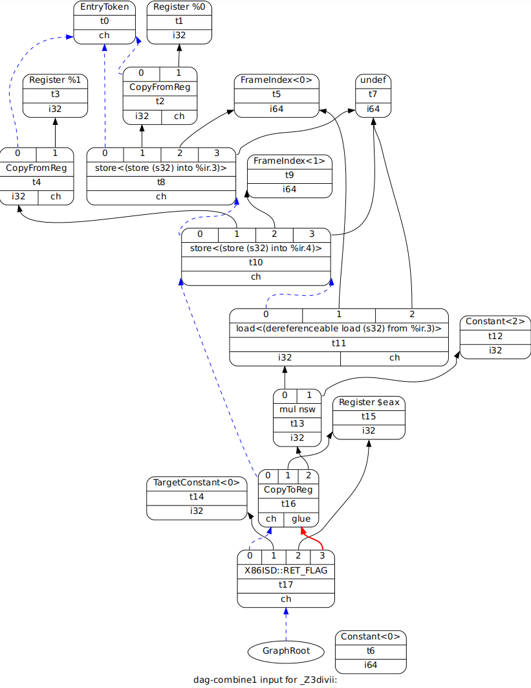
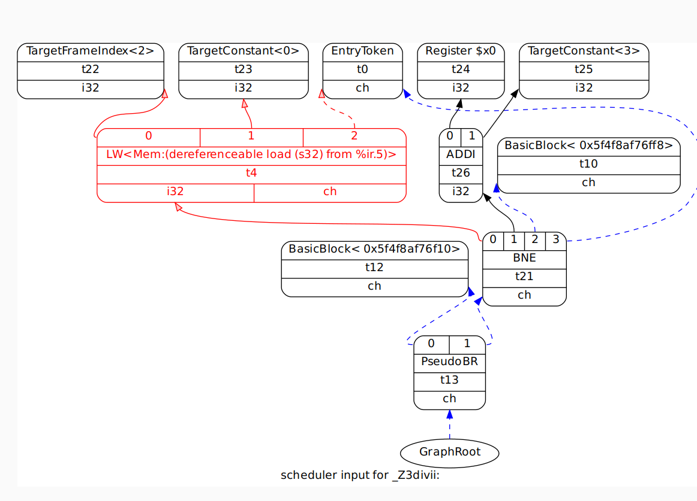
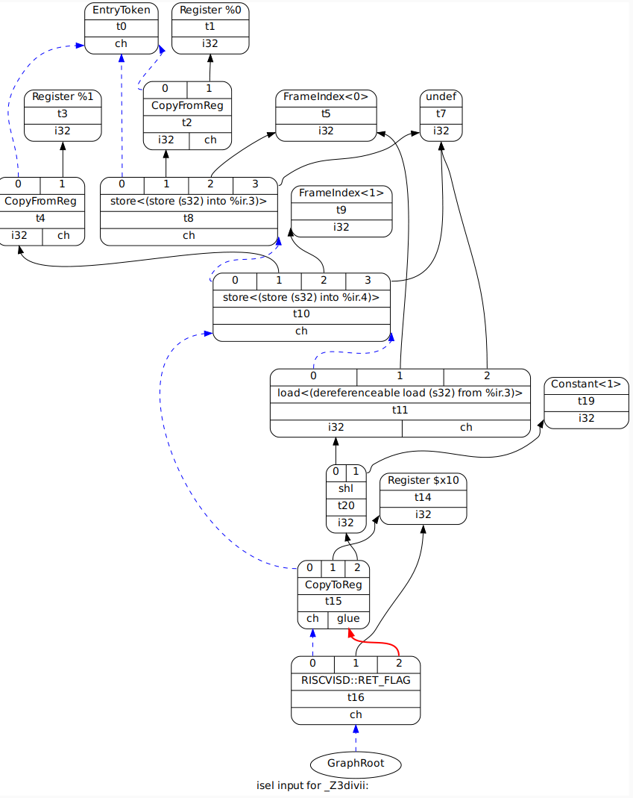

# DAG Nodes

## Before Combine1

### Chain Dependency (Always Enforcing Sequencing of Effectful Instructions)
1) EntryToken
2) GraphRoot

### Handling SSA registers
1) CopyFromReg
2) CopyToReg
3) Register (physical or virtual)

### Access arguments on Frame
1) FrameIndex -> TargetFrameIndex
2) store (later legalized as target-specific ISD node or MCInst)
3) Constant -> TargetConstant
4) Load
5) Undef

### RISC-V Operations
1) ADDI
2) LW
3) SW
4) BNE
....

### Return from function
1) RET_FLAG (target-specific)

### If Statement
1) brcond
2) br
3) BasicBlock

